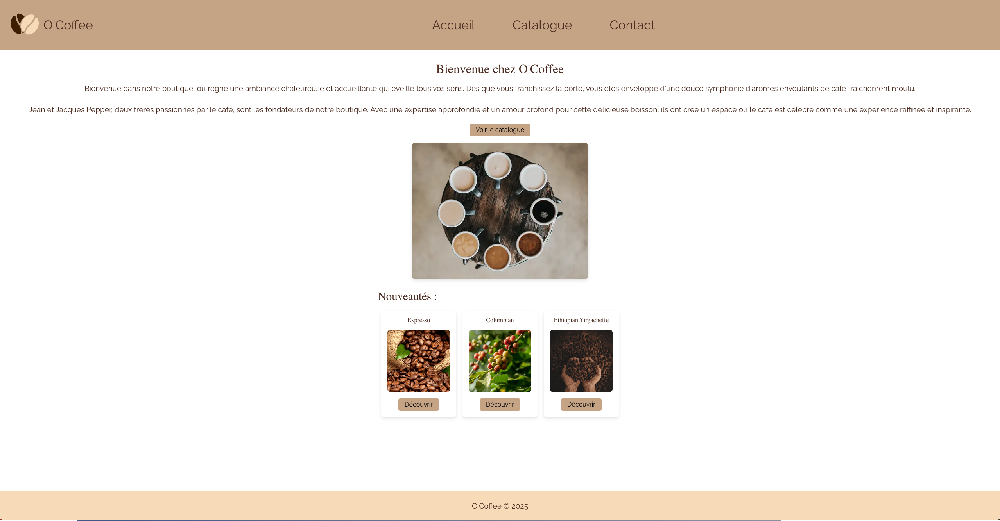

# ☕ O’Coffee - Refonte Frontend avec React

Bienvenue dans le projet **O’Coffee**, une refonte complète de l’interface utilisateur visant à remplacer le moteur de templates **EJS** par le framework **React** ⚛️.

---

## 🚀 Objectif du projet

Ce projet a été réalisé dans le cadre de ma formation de reconversion chez **O'clock** en tant que **Concepteur Développeur d'Applications**.

🎯 L’objectif principal :
> Moderniser l’interface du projet existant en passant d’un rendu côté serveur avec EJS à un front **React** dynamique, modulaire et maintenable.

---

## 🛠️ Stack technique

- **React 18**
- **React Router DOM**
- **Vite** (ou Create React App, selon ton setup)
- **Axios** pour les appels API
- Connexion à un backend Node/Express existant

---

## 📦 Fonctionnalités implémentées

- 🧭 Navigation côté client avec React Router
- 🔄 Appels API pour récupération des données produits / cafés / utilisateurs
- 🛍️ Affichage dynamique des menus et fiches produits
- 📱 Responsive design
- ♻️ Réutilisation de composants : header, footer, cartes produit, boutons, etc.
- ✅ Composants contrôlés pour les formulaires

---

## 🧪 En cours / à venir

- Intégration d’un système de panier
- Authentification utilisateur (via JWT)
- Tests unitaires avec Jest & React Testing Library
- Déploiement sur Vercel / Netlify

---

## 🧑‍💻 Auteur

👋 Je suis actuellement en reconversion dans le développement web via la formation **O'clock** Concepteur développeur d'application web & app.
Ce projet m’a permis de mettre en application mes compétences en **JS moderne, architecture React, et intégration API**.

👉 N'hésitez pas à me faire des retours, ouvrir des issues ou contribuer !

---

## 📸 Aperçu (optionnel)

